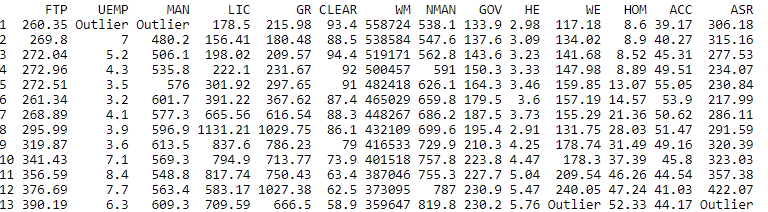

## routlier

routlier is a package that is built to look for outliers in a dataset. The functions allow a user to look for outliers that are 'x' number of deviations away from the mean in the data for a particular column. The number of 'Outliers' in a dataset will be returned. Additionally any Outlier value will now be replaced with the word 'Outlier' in the dataset.

There is also a function routlier_mad() that utilizes the MAD median absolute deviation approach to look for Outliers. The MAD approach is less susceptible to extreme outliers than the traditional Median & SD approach. See the following thesis for further explination.  [Thesis](http://d-scholarship.pitt.edu/7948/1/Seo.pdf)

```r
library(routlier)

routlier::routlier_simple(data = detroit,sd = 1)

```

## routlier:: Example with both quantitative and qualitative data

Here we will utilize the student dataset that is included in the **routlier** package. This dataset has both quantitative and qualitative data in it. You can see we have **274 outliers** when we set the **sd** argument equal to **2**.

```r

routlier_simple(data = detroit,sd = 2)

```


<br/>

```r

routlier_simple(data = student,sd = 2)

```


---

#### routlier:: Using routlier_dt_sd() we can find the **Outliers** in a data set and have them highlighted with a green background to make them easier to find. Here we have an interactive DT::table that gets returned. This allows us to filter and sort out data much more easily.

```r

routlier_dt_sd(data = detroit,sd = 2)
```


#### routlier:: Using routlier_rh_sd() we can find the **Outliers** in a data set and have them highlighted with a green background to make them easier to find.

```r

routlier_rh_sd(data = iris,sd = 3)
```


#### routlier:: Using routlier_formattable() we can find the **Outliers** in a data set and have the **Outliers** highlighted in red and the non-outlier values highlighted in green.

```r

routlier_formattable(data = detroit,sd = 2)
```


#### routlier:: Using routlier_mad() we can find the **Outliers** in a data set and have the **Outliers** highlighted in red and the non-outlier values highlighted in green. The print out also tells us how many **Outliers** are present in the data. 

```r

routlier_mad(data = mtcars,MAD = 2)
```


### Preloaded Datasets:

### Homicide in Detroit: The role of Firearms.

>This is the data set called `DETROIT' in the book 'Subset selection in
regression' by Alan J. Miller published in the Chapman & Hall series of
monographs on Statistics & Applied Probability, no. 40.   The data are
unusual in that a subset of three predictors can be found which gives a
very much better fit to the data than the subsets found from the Efroymson
stepwise algorithm, or from forward selection or backward elimination.
The original data were given in appendix A of `Regression analysis and its
application: A data-oriented approach' by Gunst & Mason, Statistics
textbooks and monographs no. 24, Marcel Dekker.   It has caused problems
because some copies of the Gunst & Mason book do not contain all of the data,
and because Miller does not say which variables he used as predictors and
which is the dependent variable.   (HOM was the dependent variable, and the
predictors were FTP ... WE)

A data frame with 13 rows and 14 variables:

* Detroit Dataset:
  + FTP: Full-time police per 100,000 population
  + UEMP: UEMP - \% unemployed in the population
  + MAN: MAN - number of manufacturing workers in thousands
  + LIC: LIC - Number of handgun licences per 100,000 population
  + GR: GR - Number of handgun registrations per 100,000 population
  + CLEAR: CLEAR - \% homicides cleared by arrests
  + WM: WM - Number of white males in the population
  + NMAN: NMAN - Number of non-manufacturing workers in thousands
  + GOV: GOV - Number of government workers in thousands
  + HE: HE - Average hourly earnings
  + WE: WE - Average weekly earnings:
  + HOM: HOM - Number of homicides per 100,000 of population
  + ACC: ACC - Death rate in accidents per 100,000 population
  + ASR: ASR - Number of assaults per 100,000 population

[Detroit Dataset](http://lib.stat.cmu.edu/datasets/detroit)

### Student Performance Dataset:


* Student Performance Data Set

>This data approach student achievement in secondary education of two Portuguese schools.
The data attributes include student grades, demographic, social and school related features) and it was collected by using school reports and questionnaires.
Two datasets are provided regarding the performance in two distinct subjects: Mathematics (mat) and Portuguese language (por).
In [Cortez and Silva, 2008], the two datasets were modeled under binary/five-level classification and regression tasks.
Important note: the target attribute G3 has a strong correlation with attributes G2 and G1. This occurs because G3 is the final year grade (issued at the 3rd period),
while G1 and G2 correspond to the 1st and 2nd period grades. It is more difficult to predict G3 without G2 and G1, but such prediction is much more useful (see paper source for more details)

* A data frame with 392 rows and 33 variables:

 <br/>
 <br/>

* Attributes for both student-mat.csv (Math course) and student-por.csv (Portuguese language course) datasets:

 + school - student's school (binary: 'GP' - Gabriel Pereira or 'MS' - Mousinho da Silveira)
 + sex - student's sex (binary: 'F' - female or 'M' - male)
 + age - student's age (numeric: from 15 to 22)
 + address - student's home address type (binary: 'U' - urban or 'R' - rural)
 + famsize - family size (binary: 'LE3' - less or equal to 3 or 'GT3' - greater than 3)
 + Pstatus - parent's cohabitation status (binary: 'T' - living together or 'A' - apart)
 + Medu - mother's education (numeric: 0 - none, 1 - primary education (4th grade), 2 – 5th to 9th grade, 3 – secondary education or 4 –  higher education)
 + Fedu - father's education (numeric: 0 - none, 1 - primary education (4th grade), 2 – 5th to 9th grade, 3 – secondary education or 4 –  higher education)
 + Mjob - mother's job (nominal: 'teacher', 'health' care related, civil 'services' (e.g. administrative or police), 'at_home' or 'other')
 + Fjob - father's job (nominal: 'teacher', 'health' care related, civil 'services' (e.g. administrative or police), 'at_home' or 'other')
 + reason - reason to choose this school (nominal: close to 'home', school 'reputation', 'course' preference or 'other')
 + guardian - student's guardian (nominal: 'mother', 'father' or 'other')
 + traveltime - home to school travel time (numeric: 1 - <15 min., 2 - 15 to 30 min., 3 - 30 min. to 1 hour, or 4 - >1 hour)
 + studytime - weekly study time (numeric: 1 - <2 hours, 2 - 2 to 5 hours, 3 - 5 to 10 hours, or 4 - >10 hours)
 + failures - number of past class failures (numeric: n if 1<=n<3, else 4)
 + schoolsup - extra educational support (binary: yes or no)
 + famsup - family educational support (binary: yes or no)
 + paid - extra paid classes within the course subject (Math or Portuguese) (binary: yes or no)
 + activities - extra-curricular activities (binary: yes or no)
 + nursery - attended nursery school (binary: yes or no)
 + higher - wants to take higher education (binary: yes or no)
 + internet - Internet access at home (binary: yes or no)
 + romantic - with a romantic relationship (binary: yes or no)
 + famrel - quality of family relationships (numeric: from 1 - very bad to 5 - excellent)
 + freetime - free time after school (numeric: from 1 - very low to 5 - very high)
 + goout - going out with friends (numeric: from 1 - very low to 5 - very high)
 + Dalc - workday alcohol consumption (numeric: from 1 - very low to 5 - very high)
 + Walc - weekend alcohol consumption (numeric: from 1 - very low to 5 - very high)
 + health - current health status (numeric: from 1 - very bad to 5 - very good)
 + absences - number of school absences (numeric: from 0 to 93)

 <br/>
 <br/>
 
* These grades are related with the course subject, Math or Portuguese:

 + G1 - first period grade (numeric: from 0 to 20)
 + G2 - second period grade (numeric: from 0 to 20)
 + G3 - final grade (numeric: from 0 to 20, output target)


[Student Dataset](http://archive.ics.uci.edu/ml/datasets/Student+Performance)


@references{
Citation Request:
Please include this citation if you plan to use this database:
P. Cortez and A. Silva. Using Data Mining to Predict Secondary School Student Performance. In A. Brito and J. Teixeira Eds., Proceedings of 5th FUture BUsiness TEChnology Conference (FUBUTEC 2008) pp. 5-12, Porto, Portugal, April, 2008, EUROSIS, ISBN 978-9077381-39-7.\cr
Available at: [](http://www3.dsi.uminho.pt/pcortez/student.pdf)

Relevant Papers:

P. Cortez and A. Silva. Using Data Mining to Predict Secondary School Student Performance. In A. Brito and J. Teixeira Eds., Proceedings of 5th FUture BUsiness TEChnology Conference (FUBUTEC 2008) pp. 5-12, Porto, Portugal, April, 2008, EUROSIS, ISBN 978-9077381-39-7.
Available at: [](http://www3.dsi.uminho.pt/pcortez/student.pdf)

[](http://www3.dsi.uminho.pt/pcortez/Home.html})
}


